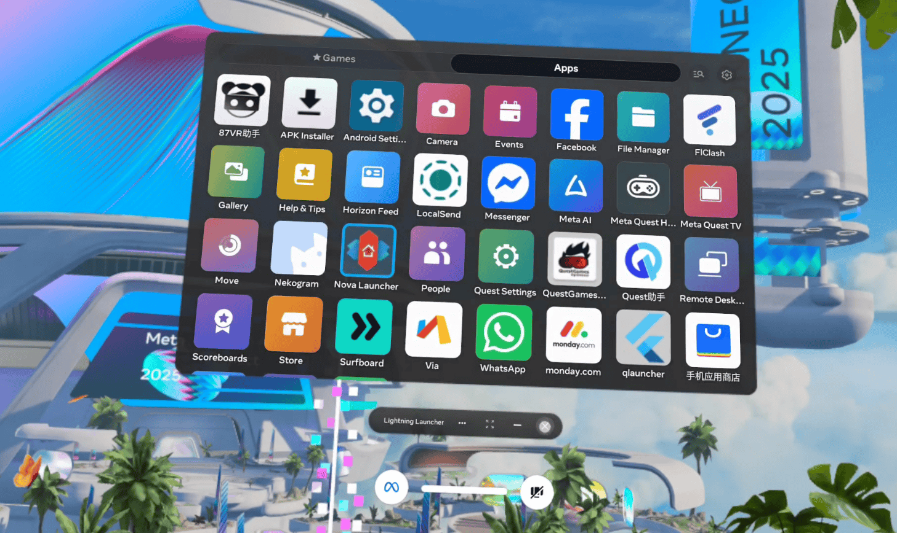

# 用于Quest的第三方应用启动器

当系统未知来源应用消失时
通过网页启动第三方APP启动器
启动器开源地址：https://github.com/zhai23/LightningLauncher

## 使用

1. 下载最新版`LightningLauncher.apk`

​	安装包地址：
​	https://github.com/zhai23/LightningLauncher/releases

2. 使用自己喜欢的方式安装到Quest上
   比如各种Quest助手
   安装完之后可能需要手动启动一次才行

3. 在Quest默认浏览器上访问这个网址，点击`启动应用`即可

​	`questz.netlify.app`

4. 为了后面方便使用，可以点击浏览器右上角菜单
   在弹出菜单中点击 `把这个网页加入你的资源库` 

​	然后就可以资源库中看到闪电启动器

## 相关项目

[threethan/LightningLauncher](https://github.com/threethan/LightningLauncher) 闪电启动器原作者

[k96e/qlauncher](https://github.com/k96e/qlauncher) 这个有创意的启动方式作者
